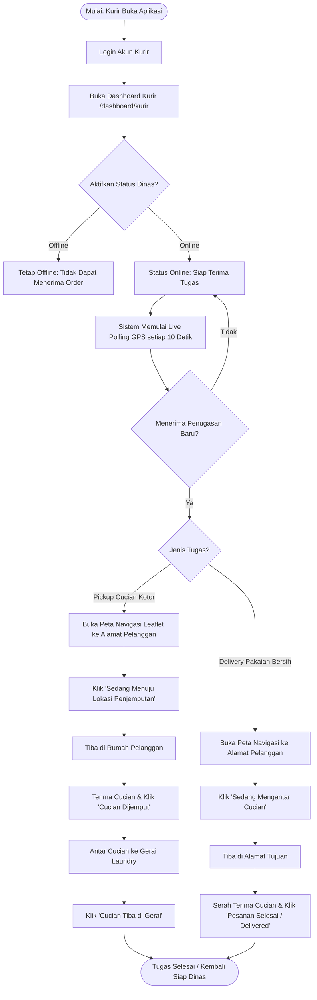

# ACTIVITY DIAGRAM: COURIER (KURIR) FLOW

Diagram aktivitas ini menggambarkan alur kerja pengguna dengan peran **Kurir Laundry** dari aktivasi status dinas hingga penyelesaian pengantaran.

```mermaid
flowchart TD
    Start([Mulai: Kurir Buka Aplikasi]) --> Login[Login Akun Kurir]
    Login --> Dashboard[Buka Dashboard Kurir /dashboard/kurir]
    Dashboard --> ToggleDuty{Aktifkan Status Dinas?}
    ToggleDuty -- Offline --> Standby[Tetap Offline: Tidak Dapat Menerima Order]
    ToggleDuty -- Online --> OnlineActive[Status Online: Siap Terima Tugas]

    OnlineActive --> PollingGPS[Sistem Memulai Live Polling GPS setiap 10 Detik]
    PollingGPS --> OrderAssigned{Menerima Penugasan Baru?}
    OrderAssigned -- Tidak --> OnlineActive
    OrderAssigned -- Ya --> CheckTaskType{Jenis Tugas?}

    CheckTaskType -- Pickup Cucian Kotor --> ViewRoutePickup[Buka Peta Navigasi Leaflet ke Alamat Pelanggan]
    ViewRoutePickup --> ClickOTWPickup[Klik 'Sedang Menuju Lokasi Penjemputan']
    ClickOTWPickup --> ArriveCustomer[Tiba di Rumah Pelanggan]
    ArriveCustomer --> PickedUpPakaian[Terima Cucian & Klik 'Cucian Dijemput']
    PickedUpPakaian --> DriveToStore[Antar Cucian ke Gerai Laundry]
    DriveToStore --> ClickArrivedStore[Klik 'Cucian Tiba di Gerai']

    CheckTaskType -- Delivery Pakaian Bersih --> ViewRouteDelivery[Buka Peta Navigasi ke Alamat Pelanggan]
    ViewRouteDelivery --> ClickOutDelivery[Klik 'Sedang Mengantar Cucian']
    ClickOutDelivery --> ArriveDestination[Tiba di Alamat Tujuan]
    ArriveDestination --> HandoverClean[Serah Terima Cucian & Klik 'Pesanan Selesai / Delivered']

    ClickArrivedStore --> End([Tugas Selesai / Kembali Siap Dinas])
    HandoverClean --> End
```
