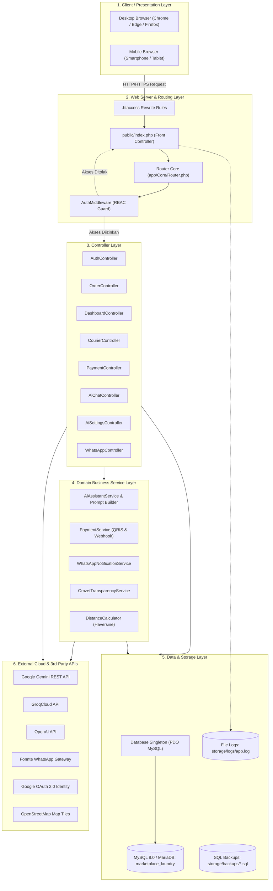

# ARSITEKTUR SISTEM LAUNDRYKU

Diagram arsitektur sistem ini menggambarkan integrasi antar-layer, alur request-response, middleware, database, dan integrasi API pihak ketiga pada LaundryKu.

```mermaid
flowchart TB
    subgraph ClientLayer["1. Client / Presentation Layer"]
        BrowserDesktop["Desktop Browser (Chrome / Edge / Firefox)"]
        BrowserMobile["Mobile Browser (Smartphone / Tablet)"]
    end

    subgraph WebServerLayer["2. Web Server & Routing Layer"]
        Htaccess[".htaccess Rewrite Rules"]
        IndexPhp["public/index.php (Front Controller)"]
        Router["Router Core (app/Core/Router.php)"]
        Middleware["AuthMiddleware (RBAC Guard)"]
    end

    subgraph ControllerLayer["3. Controller Layer"]
        AuthController["AuthController"]
        OrderController["OrderController"]
        DashboardController["DashboardController"]
        CourierController["CourierController"]
        PaymentController["PaymentController"]
        AiChatController["AiChatController"]
        AiSettingsController["AiSettingsController"]
        WhatsAppController["WhatsAppController"]
    end

    subgraph ServiceLayer["4. Domain Business Service Layer"]
        AiService["AiAssistantService & Prompt Builder"]
        PaymentService["PaymentService (QRIS & Webhook)"]
        WhatsAppService["WhatsAppNotificationService"]
        FinanceService["OmzetTransparencyService"]
        DistanceService["DistanceCalculator (Haversine)"]
    end

    subgraph DataLayer["5. Data & Storage Layer"]
        DatabaseConn["Database Singleton (PDO MySQL)"]
        MySQL[("MySQL 8.0 / MariaDB: marketplace_laundry")]
        AppLogs[("File Logs: storage/logs/app.log")]
        Backups[("SQL Backups: storage/backups/*.sql")]
    end

    subgraph ExternalGateway["6. External Cloud & 3rd-Party APIs"]
        GeminiAPI["Google Gemini REST API"]
        GroqAPI["GroqCloud API"]
        OpenAiAPI["OpenAI API"]
        FonnteAPI["Fonnte WhatsApp Gateway"]
        GoogleOAuth["Google OAuth 2.0 Identity"]
        LeafletOSM["OpenStreetMap Map Tiles"]
    end

    %% Flow Alur
    ClientLayer -->|HTTP/HTTPS Request| Htaccess
    Htaccess --> IndexPhp
    IndexPhp --> Router
    Router --> Middleware
    Middleware -->|Akses Diizinkan| ControllerLayer
    Middleware -.->|Akses Ditolak| IndexPhp

    ControllerLayer --> ServiceLayer
    ControllerLayer --> DataLayer
    ServiceLayer --> DataLayer

    ServiceLayer --> ExternalGateway
    ControllerLayer --> ExternalGateway

    DatabaseConn --> MySQL
    IndexPhp -.-> AppLogs
```
