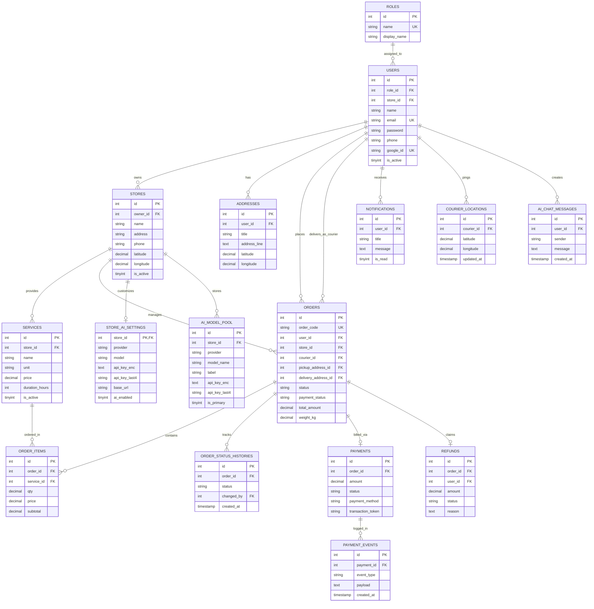

# ENTITY RELATIONSHIP DIAGRAM (ERD) LENGKAP

Diagram relasi entitas ini memetakan 25 tabel relational pada database `marketplace_laundry` beserta kardinalitas dan relasi foreign key-nya.

```mermaid
erDiagram
    ROLES {
        int id PK
        string name UK
        string display_name
    }

    USERS {
        int id PK
        int role_id FK
        int store_id FK
        string name
        string email UK
        string password
        string phone
        string google_id UK
        tinyint is_active
    }

    STORES {
        int id PK
        int owner_id FK
        string name
        string address
        string phone
        decimal latitude
        decimal longitude
        tinyint is_active
    }

    SERVICES {
        int id PK
        int store_id FK
        string name
        string unit
        decimal price
        int duration_hours
        tinyint is_active
    }

    ADDRESSES {
        int id PK
        int user_id FK
        string title
        text address_line
        decimal latitude
        decimal longitude
    }

    ORDERS {
        int id PK
        string order_code UK
        int user_id FK
        int store_id FK
        int courier_id FK
        int pickup_address_id FK
        int delivery_address_id FK
        string status
        string payment_status
        decimal total_amount
        decimal weight_kg
    }

    ORDER_ITEMS {
        int id PK
        int order_id FK
        int service_id FK
        decimal qty
        decimal price
        decimal subtotal
    }

    ORDER_STATUS_HISTORIES {
        int id PK
        int order_id FK
        string status
        int changed_by FK
        timestamp created_at
    }

    PAYMENTS {
        int id PK
        int order_id FK
        decimal amount
        string status
        string payment_method
        string transaction_token
    }

    PAYMENT_EVENTS {
        int id PK
        int payment_id FK
        string event_type
        text payload
        timestamp created_at
    }

    REFUNDS {
        int id PK
        int order_id FK
        int user_id FK
        decimal amount
        string status
        text reason
    }

    COURIER_LOCATIONS {
        int id PK
        int courier_id FK
        decimal latitude
        decimal longitude
        timestamp updated_at
    }

    NOTIFICATIONS {
        int id PK
        int user_id FK
        string title
        text message
        tinyint is_read
    }

    AI_CHAT_MESSAGES {
        int id PK
        int user_id FK
        string sender
        text message
        timestamp created_at
    }

    STORE_AI_SETTINGS {
        int store_id PK,FK
        string provider
        string model
        text api_key_enc
        string api_key_last4
        string base_url
        tinyint ai_enabled
    }

    AI_MODEL_POOL {
        int id PK
        int store_id FK
        string provider
        string model_name
        string label
        text api_key_enc
        string api_key_last4
        tinyint is_primary
    }

    ROLES ||--o{ USERS : "assigned_to"
    USERS ||--o{ STORES : "owns"
    STORES ||--o{ SERVICES : "provides"
    USERS ||--o{ ADDRESSES : "has"
    USERS ||--o{ ORDERS : "places"
    STORES ||--o{ ORDERS : "manages"
    USERS ||--o{ ORDERS : "delivers_as_courier"
    ORDERS ||--o{ ORDER_ITEMS : "contains"
    SERVICES ||--o{ ORDER_ITEMS : "ordered_in"
    ORDERS ||--o{ ORDER_STATUS_HISTORIES : "tracks"
    ORDERS ||--o| PAYMENTS : "billed_via"
    PAYMENTS ||--o{ PAYMENT_EVENTS : "logged_in"
    ORDERS ||--o| REFUNDS : "claims"
    USERS ||--o{ NOTIFICATIONS : "receives"
    USERS ||--o{ COURIER_LOCATIONS : "pings"
    USERS ||--o{ AI_CHAT_MESSAGES : "creates"
    STORES ||--o| STORE_AI_SETTINGS : "customizes"
    STORES ||--o{ AI_MODEL_POOL : "stores"
```
