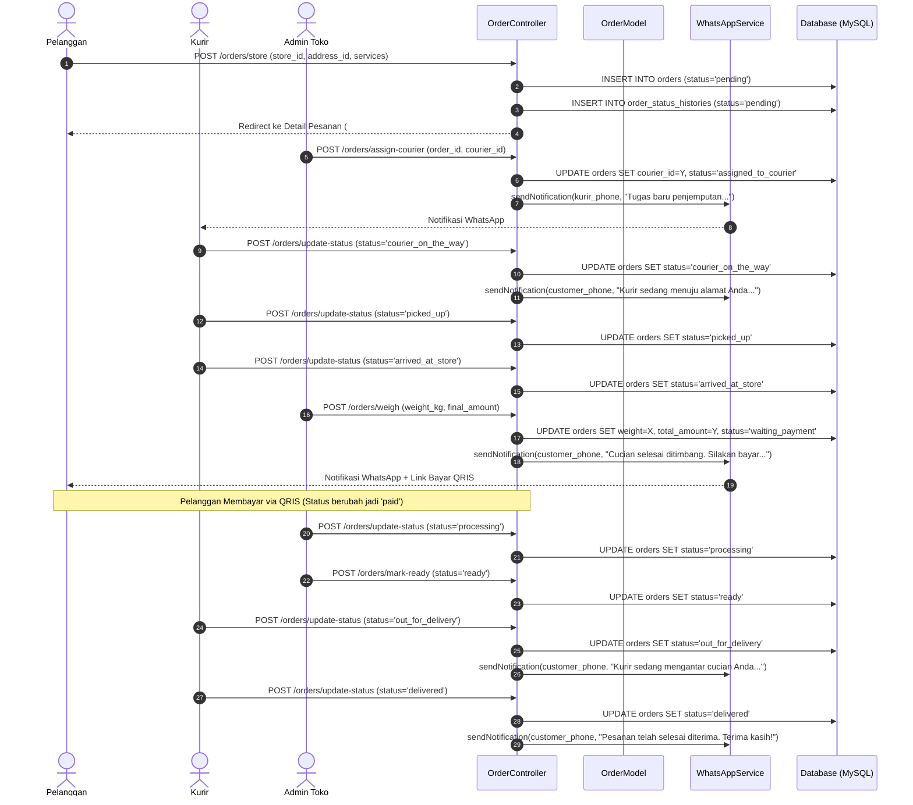

# SEQUENCE DIAGRAM: 12-STATE ORDER WORKFLOW

Diagram sekuens ini menggambarkan interaksi antara Pelanggan, Kasir, Kurir, Controller, Service, dan Database selama siklus 12 status pesanan.

```mermaid
sequenceDiagram
    autonumber
    actor C as Pelanggan
    actor K as Kurir
    actor AT as Admin Toko
    participant OC as OrderController
    participant OS as OrderModel
    participant WS as WhatsAppService
    participant DB as Database (MySQL)

    C->>OC: POST /orders/store (store_id, address_id, services)
    OC->>DB: INSERT INTO orders (status='pending')
    OC->>DB: INSERT INTO order_status_histories (status='pending')
    OC-->>C: Redirect ke Detail Pesanan (#ORD-X)

    AT->>OC: POST /orders/assign-courier (order_id, courier_id)
    OC->>DB: UPDATE orders SET courier_id=Y, status='assigned_to_courier'
    OC->>WS: sendNotification(kurir_phone, "Tugas baru penjemputan...")
    WS-->>K: Notifikasi WhatsApp

    K->>OC: POST /orders/update-status (status='courier_on_the_way')
    OC->>DB: UPDATE orders SET status='courier_on_the_way'
    OC->>WS: sendNotification(customer_phone, "Kurir sedang menuju alamat Anda...")

    K->>OC: POST /orders/update-status (status='picked_up')
    OC->>DB: UPDATE orders SET status='picked_up'

    K->>OC: POST /orders/update-status (status='arrived_at_store')
    OC->>DB: UPDATE orders SET status='arrived_at_store'

    AT->>OC: POST /orders/weigh (weight_kg, final_amount)
    OC->>DB: UPDATE orders SET weight=X, total_amount=Y, status='waiting_payment'
    OC->>WS: sendNotification(customer_phone, "Cucian selesai ditimbang. Silakan bayar...")
    WS-->>C: Notifikasi WhatsApp + Link Bayar QRIS

    Note over C,OC: Pelanggan Membayar via QRIS (Status berubah jadi 'paid')

    AT->>OC: POST /orders/update-status (status='processing')
    OC->>DB: UPDATE orders SET status='processing'

    AT->>OC: POST /orders/mark-ready (status='ready')
    OC->>DB: UPDATE orders SET status='ready'

    K->>OC: POST /orders/update-status (status='out_for_delivery')
    OC->>DB: UPDATE orders SET status='out_for_delivery'
    OC->>WS: sendNotification(customer_phone, "Kurir sedang mengantar cucian Anda...")

    K->>OC: POST /orders/update-status (status='delivered')
    OC->>DB: UPDATE orders SET status='delivered'
    OC->>WS: sendNotification(customer_phone, "Pesanan telah selesai diterima. Terima kasih!")
```
