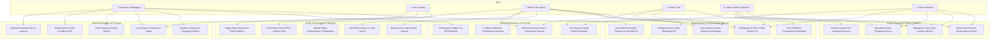

# USE CASE DIAGRAM SISTEM LAUNDRYKU

Diagram use case ini menggambarkan interaksi antara 6 aktor utama dengan fitur-fitur fungsional pada platform LaundryKu.

```mermaid
flowchart TD
    subgraph Aktor
        C["👤 Customer (Pelanggan)"]
        K["🛵 Kurir Laundry"]
        AT["🏪 Admin Toko (Kasir)"]
        OT["🏢 Owner Toko"]
        AO["⚙️ Admin Owner (Platform)"]
        O["👑 Owner Platform"]
    end

    subgraph "Modul Marketplace & Pesanan"
        UC01["Eksplorasi Katalog Toko & Layanan"]
        UC02["Kelola Alamat & Titik Koordinat GPS"]
        UC03["Buat Pesanan Laundry (Order)"]
        UC04["Lacak Status Pesanan 12-Tahap"]
        UC05["Batalkan Pesanan & Pengajuan Refund"]
    end

    subgraph "Modul Pembayaran & Finansial"
        UC06["Pembayaran Tagihan via QRIS Dinamis"]
        UC07["Verifikasi Webhook Pembayaran Otomatis"]
        UC08["Persetujuan & Audit Refund Finansial"]
        UC09["Monitoring Omzet Kasir & Transparansi Rumus"]
    end

    subgraph "Modul Operasional & Lapangan"
        UC10["Toggle Status Dinas Kurir (Online/Offline)"]
        UC11["Live Polling Posisi GPS & Tracking Peta"]
        UC12["Update Status Penjemputan / Pengantaran"]
        UC13["Input Berat Cucian & Cetak Invoice"]
        UC14["Kelola Cucian Siap Diambil / Diantar"]
    end

    subgraph "Modul Asisten AI & WhatsApp Gateway"
        UC15["Konsultasi Perawatan Pakaian via SmartBot AI"]
        UC16["Konfigurasi AI Toko & Multi-Model Pool"]
        UC17["Kirim Notifikasi Transaksional WhatsApp"]
        UC18["Kirim Laporan Omzet Harian via WhatsApp"]
        UC19["Konfigurasi Auto-Reply WhatsApp Bot"]
    end

    subgraph "Modul Manajemen Master Platform"
        UC20["Manajemen Data Pengguna (Users)"]
        UC21["Manajemen Gerai Toko Laundry (Stores)"]
        UC22["Kelola Layanan Cuci Cabang (Services)"]
        UC23["Monitoring Performa Global Seluruh Outlet"]
    end

    %% Relasi Customer
    C --> UC01
    C --> UC02
    C --> UC03
    C --> UC04
    C --> UC05
    C --> UC06
    C --> UC15

    %% Relasi Kurir
    K --> UC10
    K --> UC11
    K --> UC12

    %% Relasi Admin Toko
    AT --> UC04
    AT --> UC09
    AT --> UC13
    AT --> UC14
    AT --> UC16
    AT --> UC18
    AT --> UC19

    %% Relasi Owner Toko
    OT --> UC09
    OT --> UC16
    OT --> UC18
    OT --> UC22

    %% Relasi Admin Owner
    AO --> UC08
    AO --> UC16
    AO --> UC17
    AO --> UC20
    AO --> UC21
    AO --> UC23

    %% Relasi Owner Platform
    O --> UC08
    O --> UC16
    O --> UC20
    O --> UC21
    O --> UC23
```
